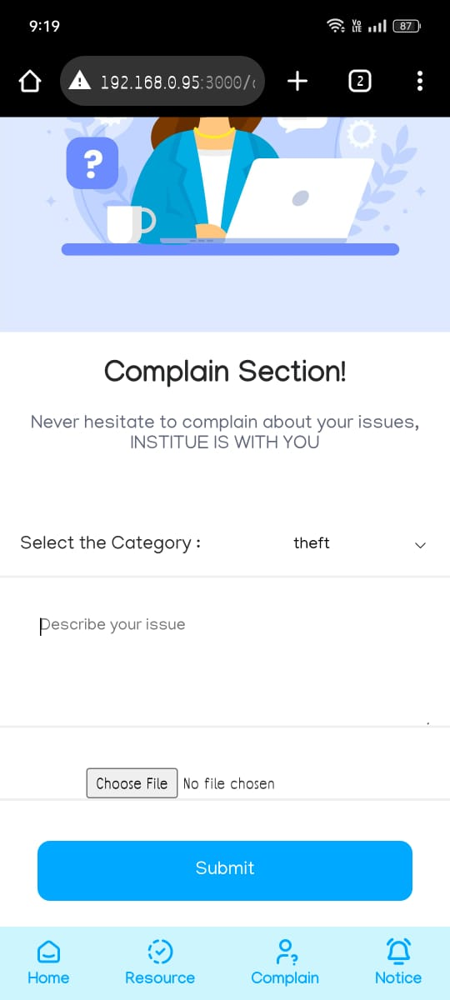

<h1 align="center">
  
</h1>

Table of Contents

- [About](#about)
  - [Motive](#Motive)
- [SafeCampus Repositories](#folder-structure)
  - [SafeCampusStudent](#SafeCampusStudent)
  - [SafeCampusSecurity](#SafeCampusSecurity)
  - [SafeCampusAdmin](#SafeCampusAdmin)
  - [backend](#backend)
- [Tech Stack](#tech-stack)
- [tools](#tools)
- [UI/UX](#folder-structure)
  - [SafeCampusStudent UI](#SafeCampusStudentUI)
  - [SafeCampusSecurity UI](#SafeCampusSecurityUI)
  - [SafeCampusAdmin UI](#SafeCampusAdminUI)

---

## About

<table>
<tr>
<td>

Integrate student, security, and admin pages with MongoDB to enhance campus security, fostering a safer learning environment through streamlined information access and management.

## Motive
- Campus SOS: Instant Extraction Feature :Empower students to signal danger spots on campus. One click triggers immediate extraction by security forces for enhanced safety.
- Campus Safety Hub: Resources & Awareness : Centralized hub featuring live awareness events via Google Meet and categorized blog posts on theft, violence, harassment, and more.
- Digital Visitor Log: Campus Entry Management : Effortlessly track campus entries and exits through a centralized online form, maintaining visitor information securely in a central database.
- Student Support Hub: Voice Your Concerns : Empower students with a complaint section to report issues, backed by video/image/audio evidence, fostering trust and support at NIT Silchar.
- Campus Security Alerts: Student Notice Board : Instantly notify students about security-related issues through a dedicated notice board on our website for enhanced campus awareness.
- Admin Portal: Streamlined Campus Management : A comprehensive platform for administrators to track visitor entries, issue emergency notices, manage student entries, complaints, and take immediate action.
- Enhanced Campus Security: Face Recognition System : Implementing a face detection algorithm to match outsider faces with criminal databases, alerting security and administrators for proactive campus safety.

 

</td>
</tr>
</table>

### 📁 SafeCampus Repository: 
- <a href="https://github.com/Lobi29/ok">🖵 safecampus student<a/>
- <a href="https://github.com/Lobi29/ok">🖵 safecampus security<a/>
- <a href="https://github.com/Lobi29/ok">🖵 safecampus admin<a/>
- <a href="https://github.com/Lobi29/ok">🖥️ backend<a/>

### 💻 Tech Stack:

&nbsp;
&nbsp;
&nbsp;

&nbsp;
&nbsp;
&nbsp;

### 🛠 Tools:

&nbsp;
&nbsp;
&nbsp;

### 🎨 SafeCampus Admin :
 

    
    
    
    
    

 

 

### 🎨 SafeCampus Student :
 

    
    
    
    
    
    

 

 

### 🎨 SafeCampus Security :
 

    
    
    
    
    
    

